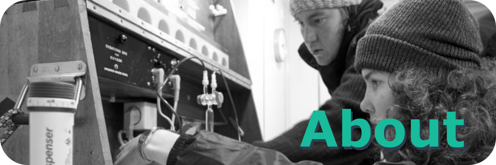

{width=100%}

Please find a complete and detailed CV including publication list [here](CV/CV_Mueller_Jens_Daniel_June_2023.pdf){target="_blank"}

# Postdoctoral employment

2020 - present  
**Postdoctoral researcher**  
ETH Zurich  
Environmental Physics | Prof. Dr. Nicolas Gruber  
EU Horizon 2020 project [4C](https://4c-carbon.eu/){target="_blank"}  

2018 - 2020  
**Postdoctoral researcher**  
Leibniz-Institute for Baltic Sea Research Warnemünde (IOW)  
Trace gas biogeochemistry | Prof. Dr. Gregor Rehder  
EU project [BONUS INTEGRAL](https://www.io-warnemuende.de/integral-home.html){target="_blank"}  

2019 - 2020  
**Guest Scientist**  
Max Planck Institute for Meteorology (MPI-M)  
Group [Observations, Analysis and Synthesis](https://www.mpimet.mpg.de/en/science/the-ocean-in-the-earth-system/scientific-working-groups/observations-analysis-and-synthesis/#c29559){target="_blank"} | Dr. Peter Landschützer  

***

# Education

2018  
**PhD Chemical Oceanography**  
Leibniz Institute for Baltic Sea Research Warnemünde (IOW)  
Supervisor: Prof. Dr. Gregor Rehder  
Title: [Ocean Acidification in the Baltic Sea: Involved Processes, Metrology of pH in Brackish Waters, and Calcification under Fluctuating Conditions](http://rosdok.uni-rostock.de/resolve/id/rosdok_disshab_0000001963){target="_blank"}  
Grade: With honors (Summa cum laude)  
EU project [BONUS PINBAL](https://www.io-warnemuende.de/pinbal-home.html){target="_blank"}

2012  
**MSc Biological Oceanography**  
GEOMAR Helmholtz Centre for Ocean Research Kiel  
Grade: 1.2 (ECTS grade A “Excellent”)  

2009  
**BSc Chemistry**  
Phillips-University Marburg  
Grade: 1.7 (ECTS grade B “Very good”)  

2008  
**Intermediate diploma Chemistry**  
Humboldt-University of Berlin  
Grade: 2.0 (ECTS grade B “Very good”)  

***

# Work experience

2013 – 2014  
**Scientific Employee**  
GEOMAR Helmholtz Centre for Ocean Research Kiel  
Benthic Ecology | Prof. Dr. M. Wahl  
Marine Biogeochemistry | Prof. Dr. U. Riebesell  

2013  
**Sailing Instructor**  
Kiel Marketing GmbH | Camp 24/7  

2013  
**Divemaster**  
Al Dive dive centre, Loubiere, Dominica  

2010  
**Research Assistant**  
GEOMAR Helmholtz Centre for Ocean Research Kiel  
Evolutionary Ecology of Marine Fishes | Prof. Dr. T. Reusch  

***

# Funding

2019  
**SPECTROPHABS** (**Spectro**photometric **pH**-measurements for monitoring of marine **a**cidification in the **B**altic **S**ea)  
Co-applicant

2018  
**Early-Career Grant**  
**National Geographic Society**  
Financial and outreach support for [Bloomsail](https://www.io-warnemuende.de/Tina-V-home-en.html){target="_blank"} expedition  

2010-2018  
**German Academic Scholarship Foundation** (Studienstiftung des deutschen Volkes)

* PhD scholarship (ideational)
* Full student scholarship
* Field work grant, Patagonia, Chile
* Advanced English course, Bath, England
* Summer academy, San Giovanni, Italy

***

# Awards

2019  
**Briese Award**  
for outstanding PhD thesis in Marine Research  

2019  
**Dissertation award**  
German Water Chemical Society  
sponsored by Walter-Kölle foundation  

2019  
**Dissertation award**  
Baltic Sea Research Foundation  

2017  
**Best poster presentation by newcomers**  
Baltic Sea Science Congress  

2005  
Book-price for extraordinary achievements during the Abitur  

***

# Extracurricular acitvities

2011  
**Certified Scientific Diver**  
200+ logged dives, dive mission leader, Nitrox-diver  
Expeditions:  
Off-shore mesocosm experiment, Gran Canaria, Spain (2 months)  
Huinay Scientific Field Station, Patagonia, Chile (3 months)

Since 2010  
**Member of the Academic Sailing Association in Kiel** ([ASViK e.V.](https://www.asv-kiel.de){target="_blank"})  
Several sailing campaigns including ocean crossings  
Holder of boat driver, safety and radio certificates  

2006 - 2009  
Founder and Chairman of [Growtogether e.V](https://www.growtogether.wordpress.com){target="_blank"}  
Association to support developmental cooperation

***
