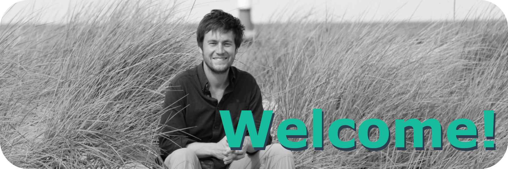

{width=100%}

Please find a complete and detailed CV including publication list [here](CV/CV_Mueller_Jens_Daniel_2019.pdf)

# Education

2018  
**PhD Chemical Oceanography**  
Leibniz-Institute for Baltic Sea Research Warnemünde (IOW)  
Supervisor: Prof. Dr. Gregor Rehder  
Title: Ocean Acidification in the Baltic Sea: Involved Processes, Metrology of pH in Brackish Waters, and Calcification under Fluctuating Conditions  
Grade: with honors (summa cum laude)  

2012  
**MSc Biological Oceanography**  
GEOMAR Helmholtz Centre for Ocean Research Kiel  
Grade: 1.2 (equivalent to ECTS grade A “Excellent”)  

2009  
**BSc Chemistry**  
Phillips-University Marburg  
Grade: 1.7 (equivalent to ECTS grade B “Very good”)  

2008  
**Intermediate diploma Chemistry**  
Humboldt-University of Berlin  
Grade: 2.0 (equivalent to ECTS grade B “Very good”)  

***

# Employment

Since 2018  
**PostDoc**  
Leibniz-Institute for Baltic Sea Research Warnemünde (IOW)  
Funded by EU project BONUS INTEGRAL  
PI of BloomSail  

2013 – 2014  
**Scientific Employee**  
GEOMAR Helmholtz Centre for Ocean Research Kiel  
Benthic Ecology, Prof. Dr. M. Wahl  
Marine Biogeochemistry, Prof. Dr. U. Riebesell  

2013  
**Sailing Instructor**  
Kiel Marketing GmbH | Camp 24/7  

2013  
**Divemaster**  
Al Dive dive centre, Loubiere, Dominica  

2010  
**Research Assistant**  
GEOMAR Helmholtz Centre for Ocean Research Kiel  
Research Unit Evolutionary Ecology of Marine Fishes, Prof. Dr. T. Reusch  

***

# Funding

2018  
**Early-Career Grant**  
**National Geographic Society**  
Financial and outreach support for Bloomsail expedition  

2010-2018  
**German Academic Scholarship Foundation**  
PhD scholarship (ideational)  
Full student scholarship  
Field work grant, Patagonia, Chile  
Advanced English course, Bath, England  
Summer academy, San Giovanni, Italy  

***

# Awards

2019  
**Briese Award**  
for outstanding PhD thesis in Marine Research  

2019  
**Dissertation award**  
**German Water Chemical Society**  
sponsored by Walter-Kölle foundation  

2019  
**Dissertation award**  
**Baltic Sea Research Foundation **

2017  
**Best poster presentation by newcomers**  
Baltic Sea Science Congress  

2005  
Book-price for extraordinary achievements during the Abitur  

***

# Extracurricular acitvities

2011  
**Certified Scientific Diver**  
200+ logged dives, dive mission leader, Nitrox-diver  
Expeditions:  
Off-shore mesocosm experiment, Gran Canaria, Spain (2 months)  
Huinay Scientific Field Station, Patagonia, Chile (3 months)

Member of the Academic Sailing Association (ASV e.V.) Kiel  
Several sailing campaigns including ocean crossings  
Holder of boat driver, safety and radio certificates  

Founder and Chairman of [Growtogether e.V](www.growtogether.wordpress.com)  
Association to support developmental cooperation

***
