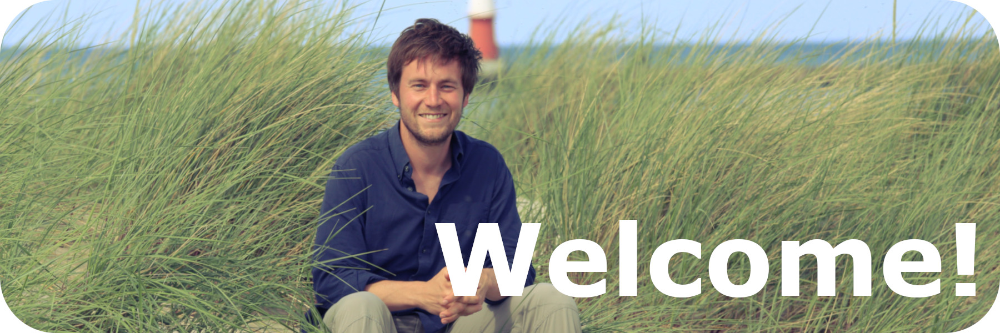

{width=100%}

## Marine Biogeochemistry & a pinch of Data Science

***

My name is Jens and I am a marine biogeochemist, meaning I try to understand how organisms - including the two of us - shape their chemical environment, and vice versa. To do so, I enjoy wrangling, visualizing, synthesizing and thereby understanding data obtained mainly from autonomous observatories such as voluntary observing ships, floats and buoys. If the CO~2~ content of seawater is involved in one way or another, this makes me even more happy.

Want to know more? Come in and have a look!

