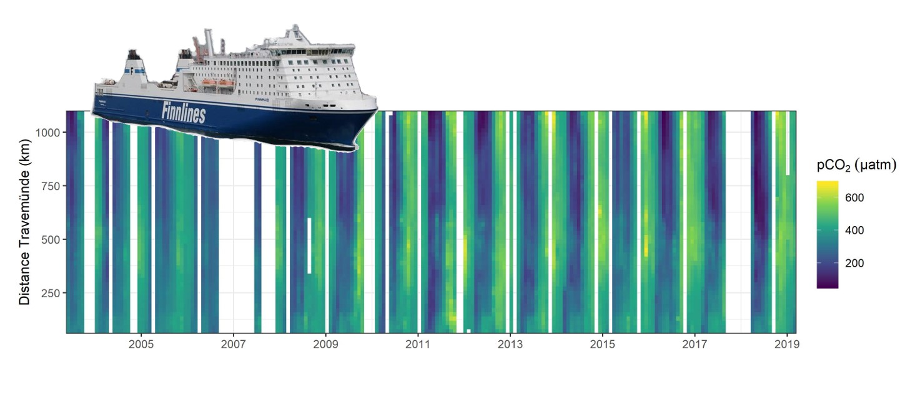
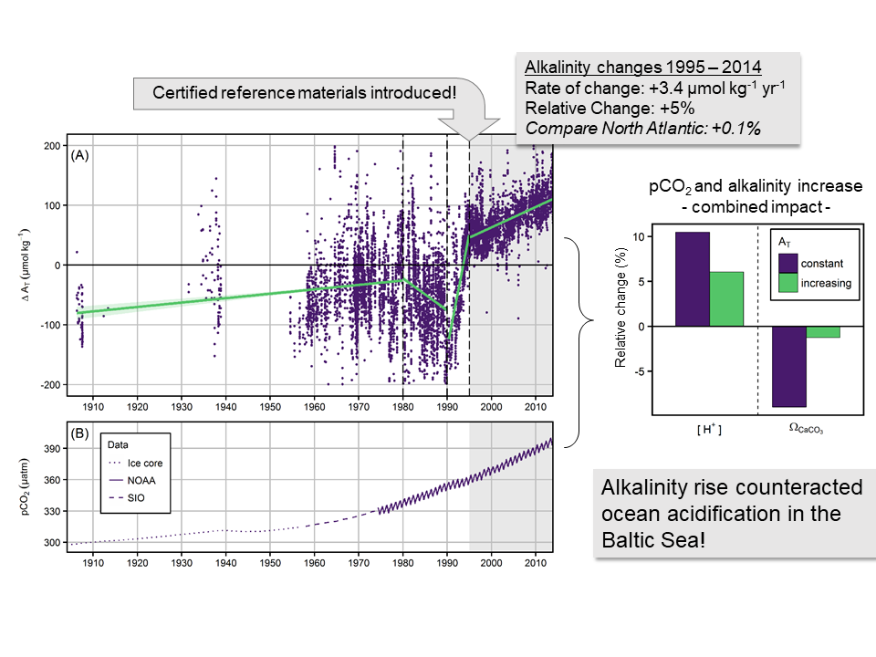
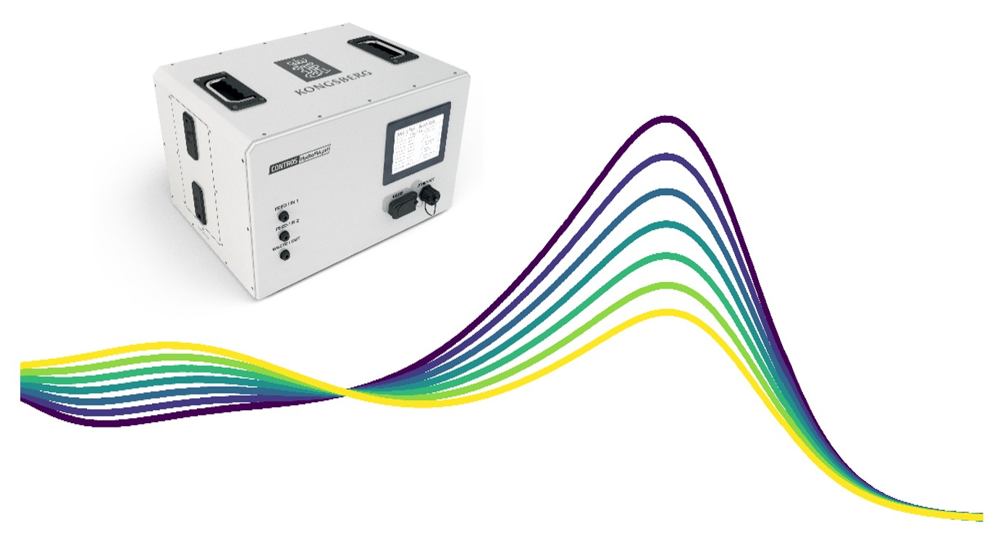

{width=100%}

## The Global Ocean Carbon Cycle
### Understanding the Anthropogenic Perturbation by Analysing Ship-based and Autonomous Observations

As pointed out in a recent [ocean carbon review paper](https://doi.org/10.1038/s43017-022-00381-x){target="_blank"} that Nicolas Gruber, myself and a bunch of fantastic colleagues published in Nature Reviews Earth & Environment, the ocean carbon sink is much more variable than people thought for a long time. One of my main interests is to understand this variability by analysing measurements of the CO~2 content in seawater that were repeatedly obtained from ships over the past 3-4 decades. Applying the [eMLR(C*) method](https://doi.org/10.1002/2017GB005819){target="_blank"} (some call it the eMLR magic), I reconstructed the [accumulation of anthropogenic carbon in the global ocean interior from 1994 – 2014](https://doi.org/10.22541/essoar.167525217.76035050/v1){target="_blank"}. Resolving the changes over two decades separately enabled me to detect drastic variability (or trends?) in the accumulation rates of anthropogenic carbon, in particular in the Atlantic Ocean. In the context of [RECCAP2](https://reccap2-ocean.github.io/){target="_blank"} - the second cycle of the REgional Carbon Cycle Assessment and Processes project - I worked with an international board of around 100 scientists to investigate this variability from many different perspectives, e.g., by analysing the output of ocean biogeochemical models and surface flux estimates based on pCO~2 measurements.

{width=80%}

***

## Baltic Sea Biogeochemistry
### Using pCO~2~ Measurements on a Voluntary Observing Ship to Quantify Net Community Production

Since 2003 automated pCO~2~ measurements are running on the VOS [Finnmaid](http://www.icos-infrastruktur.de/icos-d/komponenten/ozeane/vos/ostsee-c1/){target="_blank"} that commutes between Helsinki/Finland in the north and Travemünde/Germany in the south, thereby crossing the Central Baltic Sea several times a week. The resulting data set is available through [SOCAT](https://www.socat.info/){target="_blank"}, comprises by now more than three million pCO~2~ measurements and allows us to determine the net community production with highest spatio-temporal resolution and unreached accuracy. We recently summarized the main findings from almost two decades of measurements in the book [Biogeochemical Transformations in the Baltic Sea: Observations Through Carbon Dioxide Glasses](https://www.springer.com/de/book/9783319616988){target="_blank"}.

Next steps? Blend Finnmaid data with observations from biogeochemical ARGO floats, hydrographical GETM model data and eventually remote sensing Chlorophyll estimates to extend our understanding of net community production vertically and horizontally. Some of this is already in progress in the framework of [EU BONUS INTEGRAL](https://www.io-warnemuende.de/integral-home.html){target="_blank"}.

{width=80%}

***

## Interpreting Global Change on Regional Scales
### Alkalinity Rise Counteracted Acidification in the Baltic Sea

The oceans take up Gigatonnes of anthropogenic CO~2~ year by year, thereby getting more and more acidic. This process is simple chemistry at its best and therefore very predictable. Everywhere? Nope! In the Baltic Sea, I detected an [increasing alkalinity trend that buffered acidification](https://aslopubs.onlinelibrary.wiley.com/doi/full/10.1002/lno.10349){target="_blank"} as expected from the atmospheric CO~2~ forcing by roughly 50%. How does it continue? No idea, because we do not yet completely understand the drivers for the past alkalinity rise. As the process might also inverse, we better start a reliable acidification monitoring soon and continue to keep an eye on the alkalinity, here and elsewhere in the world.

{width=80%}

***

## Measuring pH in Brackish Waters
### Achieving Oceanic Standards through a Coordinated Series of Calibration Experiments

We can measure ocean acidification since spectrophotometric pH measurements were introduced for oceanic conditions in the early 1990s. However, when I started my PhD we did not even have pH buffers for salinities below 20 and were still tracking pH in the Baltic Sea with glass electrodes (too low accuracy) at a few stations (too low spatial resolution) visited few times a year (too low temporal resolution). This had to be improved! With the help of the pH godfather himself, Dr. [Andrew Dickson](http://scrippsscholars.ucsd.edu/adickson){target="_blank"} (SCRIPPS), and Germany's national metrological institute, [PTB](https://www.ptb.de/cms/en/ptb/fachabteilungen/abt3/fb-31/ag-313.html#maincontent_forschung_header){target="_blank"}, we produced a series of [pH buffer solutions](https://www.frontiersin.org/articles/10.3389/fmars.2018.00176/full){target="_blank"} in the salinity range 5-20, [characterized the pH-dye m-Cresol purple](https://www.frontiersin.org/articles/10.3389/fmars.2018.00177/full){target="_blank"} and made sure that [neither elevated amounts of dissolved organic matter nor hydrogen sulfide interfere](https://aslopubs.onlinelibrary.wiley.com/doi/full/10.1002/lom3.10227){target="_blank"} with the spectrophotometric method. A paper trilogy for a PhD degree? Deal!

In addition to this rather fundamental chemical characterization work achieved in the framework of the EU project [BONUS PINBAL](https://www.io-warnemuende.de/pinbal-home.html){target="_blank"}, we developed also the flow-through pH analyzer [CONTROS HydroFIA&reg; pH](https://www.kongsberg.com/maritime/products/mapping-systems/Chemical-Sensors-and-Analyzers/HydroFIA-pH/){target="_blank"} now available on the market.

Ready, set, go out to sea (or sent your drones) and use that stuff!

{width=80%}

***

## BloomSail Expedition
### Quantification and Control of Cyanobacteria Blooms

Our pCO~2~ measurement on VOS Finnmaid (see above) miss one important feature: The vertical extension of the CO~2~ draw down that we use to quantify net community production. For the spring bloom we can fix that by looking at the vertical depletion of nutrients after the bloom. But in mid-summer, when cyanobacteria kick-in, which are capable of fixing N~2~ and are known to cope with very variable amounts of Phosphate, there is now other way than going out there and measure pCO~2~ at depth. Unfortunately, the blooms occur for a few days some when between June and August, so I had to spend three months at sea to be there in time. Classical research vessel cost ~10k&euro; a day. My boss and many others would have killed me if I had even dared to ask. So, I rather relied on a small funding from the National Geographic Society and my beloved sailing vessel Tina V to spend summer 2018 at sea (though my boss still wanted to kill me at first). The outcome is expected to be published soon.

{width=80%}

***
